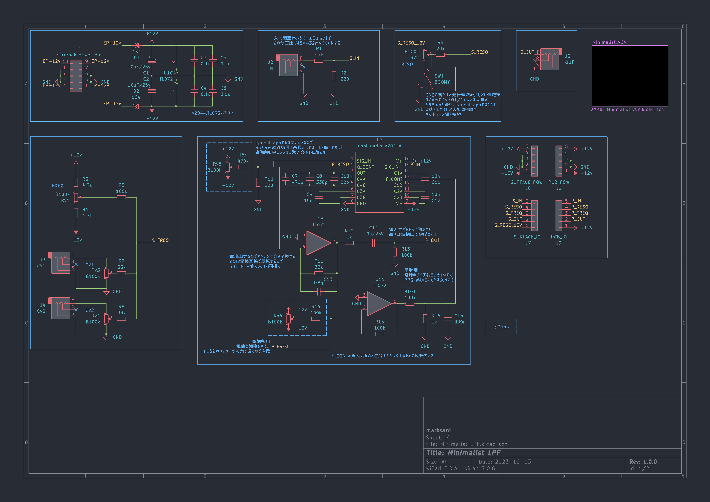

# Minimalist LPF

Eurorack 4HP Simple Lowpass filter using V2044A (4 pole ladder)

## Specification

### Power

|Use Voltage|Current consumption|
|:--|:--|
|+12V|9mA|
|-12V|9mA|

### Input

|Name|Description|
|:--|:--|
|IN||
|CV1|Freq Modulation Depth 1|
|CV2|Freq Modulation Depth 2|

### Output

|Name|Description|
|:--|:--|
|OUT|AC Coupling|

### Controller

|Name|Description|
|:--|:--|
|Freq|Frequency|
|Reso|Resonance|
|CV1|Freq Modulation Depth 1|
|CV2|Freq Modulation Depth 2|

## Image
  

## Schematic

## Demonstration
